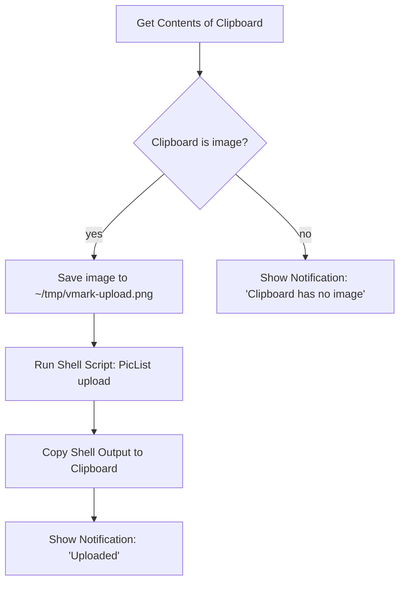

# Cloud-hosted Images

VMark is a local-first writing tool. It does not ship a built-in uploader for images you paste from the clipboard, and it does not store cloud credentials. If you need your Markdown to contain public CDN URLs (for blog publishing, cross-device sync, CMS posting), the workflow is an OS-level automation that runs *outside* VMark and feeds the result back in.

This page explains why VMark works this way, what already works without any extra setup, and how to wire up the Shortcuts.app recipe in about ten minutes.

[[toc]]

## What VMark already supports

VMark distinguishes two directions when handling image references in Markdown:

| Direction | Status | Trigger | Output in Markdown |
|-----------|--------|---------|--------------------|
| Inserting an existing remote URL | Supported | Paste or type a `https://…` URL | The URL, unchanged |
| Markdown source with a remote URL | Supported | Anyone writes `` | Renders directly |
| Inserting a local image | Supported | Paste, drop, or insert a binary | Copied to `.assets/`, relative path written |
| Inserting a local image *but storing remotely* | **Not built in** | (See recipe below) | — |

In short: if the image already lives at a URL, paste the URL. VMark inserts it as a Markdown image reference and the webview fetches it. The read path is already cloud-friendly.

## Why VMark does not include native cloud upload

The proposed feature would mean VMark detects a local image at paste time, uploads it to remote storage, and writes the returned URL into the Markdown instead of a `./.assets/…` path. That sounds small but expands VMark's scope in three load-bearing ways:

1. **Credential vault**. Native S3-compatible upload needs the user's access key and secret access key stored at rest. VMark today has zero long-lived secrets — no encryption-at-rest decisions, no OS-keychain integration, no key-rotation UX, no accidental-key-in-Markdown failure mode. Adding upload moves VMark across that line.

2. **Multi-provider support tail**. S3, Cloudflare R2, Backblaze B2, MinIO, DigitalOcean Spaces all advertise S3-compatibility but each has its own quirks (path-style vs virtual-hosted addressing, ACL semantics, regional endpoints, CORS rules). One maintainer absorbing that surface area is a long-term tax on a writing tool.

3. **Composition vs. ownership**. Tools like [PicList](https://github.com/Kuingsmile/PicList) and [PicGo](https://github.com/Molunerfinn/PicGo) already solve this problem, including provider-specific config and credential storage. macOS Shortcuts.app and Keyboard Maestro can glue those tools into any text field on the system — not just VMark. Building cloud upload into VMark would duplicate code that lives better outside it, and would only work in VMark.

The decision is therefore: **VMark stays a writing tool; image uploading lives in the user's OS-level automation toolbox**. The recipe below makes the OS-level path concrete.

## Recipe: Shortcuts.app + PicList (macOS, free)

Shortcuts.app ships with macOS Monterey (12) and later. PicList is a free open-source image uploader. Together they give you a hotkey that takes whatever image is currently on the clipboard, uploads it via PicList (which already knows how to talk to R2, S3, Imgur, and dozens of other backends), and replaces the clipboard with the returned URL. After that, `Cmd+V` in VMark inserts the URL — VMark's existing remote-URL detection handles the rest.

### Prerequisites

1. **PicList installed and configured.** Download from the [PicList releases page](https://github.com/Kuingsmile/PicList/releases), open it once, and configure at least one image host (R2, S3, Imgur, smms, etc.) under PicList's *PicBed Settings*. Confirm a manual upload works inside PicList itself before wiring up the Shortcut — that isolates "is PicList working" from "is my Shortcut wired correctly."

2. **PicList CLI available.** PicList exposes an `upload` subcommand via its app bundle. On macOS the binary lives at `/Applications/PicList.app/Contents/MacOS/PicList`. Verify with:

   ```sh
   /Applications/PicList.app/Contents/MacOS/PicList upload --help
   ```

   The command should return CLI help. If it does not, check that PicList is installed in `/Applications` (not `~/Applications` — adjust the path if so).

### Build the Shortcut

Open `Shortcuts.app` and create a new shortcut. Add these actions in order:



Concrete steps in the Shortcuts editor:

1. **Action: Get Contents of Clipboard.** Drag this in from the actions sidebar. No configuration.

2. **Action: If.** Set condition: *Clipboard is Media › Image*. (If the dropdown does not show *Media*, use *Contents › has any value* as a looser check.)

3. **Inside the If branch — Action: Save File.** Configure:
   - Service: *Files*
   - Destination: `~/tmp/` (create the folder once via Finder if it does not exist).
   - File name: `vmark-upload.png` (a fixed name keeps the path predictable for the next step).
   - Disable *Ask Where To Save* so the shortcut runs unattended.

4. **Action: Run Shell Script.** Configure:
   - Shell: `/bin/zsh` (default on macOS).
   - Input: *Pass Input as `stdin`* — actually we want `as arguments`. (Either works; the script below ignores stdin and uses a literal path.)
   - Script body:

     ```sh
     /Applications/PicList.app/Contents/MacOS/PicList upload "$HOME/tmp/vmark-upload.png" 2>/dev/null | tail -n 1
     ```

   The `tail -n 1` is defensive: PicList may print informational log lines before the URL. Confirm the actual output shape against your PicList version once; if PicList returns only the URL, `tail` is a no-op.

5. **Action: Copy to Clipboard.** Set its input to the *Shell Script Result*.

6. **Action: Show Notification.** Title: `Uploaded`. Body: *Shell Script Result*. This confirms the URL is on the clipboard and shows you what was uploaded.

7. **(Optional) Else branch — Action: Show Notification.** Title: `No image on clipboard`. Helps debug when the hotkey fires but the clipboard wasn't actually holding an image.

### Bind a global hotkey

In the Shortcuts editor, click the shortcut's *(i)* info button, then *Add Keyboard Shortcut*. Pick something that does not collide with VMark's shortcuts — `Control + Option + Command + U` is a common choice (no macOS conflicts, mnemonic "Upload").

### Use it

1. Take a screenshot with `Cmd + Shift + Ctrl + 4` (saves to clipboard, not disk) — or copy any image from another app.
2. Press your upload hotkey (`Ctrl + Opt + Cmd + U`).
3. Wait ~1–3 seconds for the notification.
4. Paste in VMark (`Cmd + V`). The Markdown gets ``.

### What can go wrong

| Symptom | Likely cause | Fix |
|---------|--------------|-----|
| Shortcut fires but PicList does not run | Wrong path to PicList binary | Confirm `/Applications/PicList.app/Contents/MacOS/PicList` exists; adjust if installed elsewhere |
| Notification shows but clipboard still has the image | Shell script returned empty | Run the shell script manually with a known-good file path to see PicList's actual output |
| URL is wrong / has trailing whitespace | `tail -n 1` picked up a log line, not the URL | Inspect PicList output; adjust the parsing (`grep -oE 'https://[^[:space:]]+' \| tail -n 1` is a stricter alternative) |
| `Cmd + V` in VMark inserts plain text instead of an image | The URL does not end with an image extension PicList knows | Confirm the file extension is preserved through the upload (R2/S3 typically preserve it; check your bucket key template) |

## Alternative: Keyboard Maestro

[Keyboard Maestro](https://www.keyboardmaestro.com/) is a paid macOS automation tool with a higher ceiling than Shortcuts.app. The main practical advantage for this workflow: KM can intercept `Cmd + V` directly when the clipboard contains an image, so you upload-and-paste in one keystroke instead of two (hotkey, then `Cmd + V`).

The recipe is structurally identical to the Shortcuts.app version — get clipboard image, save to file, run PicList CLI, replace clipboard, optionally simulate paste. KM's *Trigger* macro builder is more flexible (clipboard-content trigger, app-specific scope) but the upload step is the same.

If you're not already a Keyboard Maestro user, Shortcuts.app is the cheaper answer.

## Alternative: pre-publish processing script

For users with a self-hosted blog or static-site pipeline, the cleanest answer is often: keep VMark's default behavior (`.assets/` relative paths), and run a build-time script that walks the Markdown, uploads each unique image, and rewrites the path. This trades per-image upload latency for batched-upload-on-publish, and keeps the editor surface clean.

A minimal sketch (Node.js, pseudocode):

```js
// scan-and-upload.js
const fs = require("fs");
const { execSync } = require("child_process");

const md = fs.readFileSync(process.argv[2], "utf8");
const rewritten = md.replace(/!\[(.*?)\]\((\.\/\.assets\/[^)]+)\)/g, (_, alt, path) => {
  const url = execSync(
    `/Applications/PicList.app/Contents/MacOS/PicList upload "${path}"`,
  ).toString().trim();
  return ``;
});
fs.writeFileSync(process.argv[2].replace(/\.md$/, ".published.md"), rewritten);
```

Several static-site generators (Hugo with [Page Bundles](https://gohugo.io/content-management/page-bundles/), Jekyll, Astro, Eleventy) handle relative `.assets/` paths natively at build time — no script needed if you publish that way.

## Already-hosted URLs

For completeness: if an image already lives at a public URL, paste the URL into VMark and you're done. The clipboard image-path detector classifies it as `type: "url"` and writes the URL directly. No upload, no `.assets/` copy, no settings to change. This is the simplest cloud-image workflow VMark supports and it requires no extra tools.

## See also

- [Files & Images settings](./settings.md) — auto-resize, copy-to-assets, orphan cleanup
- [Privacy](./privacy.md) — what VMark stores locally and what leaves your machine
